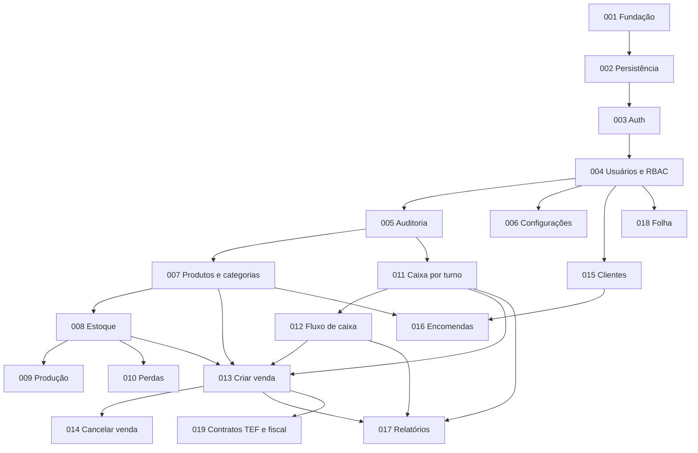

# Specs do Backend — S-M-Panificadora-V2

- **Fonte:** `docs/prd/PRD-001-backend-S-M-Panificadora-V2.md`
- **Arquitetura:** `docs/adr/ADR-001-clean-code-solid.md`
- **Regra de execução:** implementar **na ordem numérica**. Uma spec só começa quando a anterior está no Definition of Done.

Cada spec é uma **entrega vertical testável**: ao terminá-la, o sistema faz algo novo que dá para provar com testes automatizados (e, quando houver HTTP, com chamada real). Não se entrega “metade de regra de negócio” sem critério de aceite.

---

## 1. Como usar

1. Abrir a spec da vez (`SPEC-00N-...md`).
2. Implementar só o que está no escopo. O que está em “fora de escopo” pertence a uma spec posterior.
3. Cobrir o **plano de testes** da própria spec (unidade sem banco + integração do fluxo crítico).
4. Só então avançar para a próxima.

Não pular specs. Dependências circulares foram quebradas de propósito (ver seção 3).

---

## 2. Ordem incremental

| Spec | Entrega | O que fica testável ao concluir |
|---|---|---|
| [SPEC-001](./SPEC-001-fundacao-da-aplicacao.md) | Fundação HTTP e camadas | Health, erros sem stack, CORS, CSP, rate limit geral, abort sem `JWT_SECRET` |
| [SPEC-002](./SPEC-002-persistencia-e-transacoes.md) | Banco, migrations, transação | Migrate up; rollback de transação; readiness com DB |
| [SPEC-003](./SPEC-003-autenticacao-e-sessao.md) | Login, JWT, seed admin | Login ok/falha genérica; 401 em rota protegida; troca de senha do seed |
| [SPEC-004](./SPEC-004-usuarios-e-rbac.md) | CRUD de usuários e permissões | Admin cria operador; operador é bloqueado; admin não tem permissão parcial |
| [SPEC-005](./SPEC-005-auditoria.md) | Infra de auditoria | Mutação gera log; falha de auditoria não derruba a operação |
| [SPEC-006](./SPEC-006-configuracoes.md) | Parâmetros da loja | Upsert nome/slogan; logo com limite; leitura pública para login |
| [SPEC-007](./SPEC-007-produtos-e-categorias.md) | Catálogo | CRUD; unicidade de nome por categoria; soft delete |
| [SPEC-008](./SPEC-008-estoque.md) | Estoque diário | Fórmula de disponível; rollover; upsert; erro de negócio (não 500) |
| [SPEC-009](./SPEC-009-producao.md) | Produção | Lançamento incrementa `produzido` com rastro de quem/quando |
| [SPEC-010](./SPEC-010-perdas.md) | Perdas | Registro debita estoque; custo automático; whitelist de motivo |
| [SPEC-011](./SPEC-011-caixa-por-turno.md) | Caixa — abrir/fechar/prévia | Um turno aberto por período; período fixado na abertura; diferença |
| [SPEC-012](./SPEC-012-fluxo-de-caixa.md) | Fluxo de caixa | Lançamento manual no turno; filtro por turno (não por data corrida) |
| [SPEC-013](./SPEC-013-pdv-criar-venda.md) | PDV — criar venda | Transação única: venda + itens + estoque + fluxo; bloqueio sem turno |
| [SPEC-014](./SPEC-014-pdv-cancelar-venda.md) | PDV — cancelar venda | Soft delete; estorno no fluxo; reversão de estoque na data original |
| [SPEC-015](./SPEC-015-clientes.md) | Clientes | CRUD mínimo; soft delete |
| [SPEC-016](./SPEC-016-encomendas.md) | Encomendas | Numeração própria; total no backend; soft delete |
| [SPEC-017](./SPEC-017-relatorios.md) | Relatórios | Vendas, fechamento, ABC, resultado; paginação |
| [SPEC-018](./SPEC-018-funcionarios-e-folha.md) | Folha (macro) | Cadastro mínimo; detalhe fica na PRD específica |
| [SPEC-019](./SPEC-019-contratos-tef-e-fiscal.md) | Contratos TEF e fiscal | Ports + adapters no-op; caso de uso de venda não conhece provedor |

### Núcleo para operar a loja no balcão

Specs **001 → 014**. Sem isso não há venda íntegra (catálogo, estoque, turno, venda, cancelamento).

Specs **015–016** habilitam encomendas. **017** é gestão. **018** não bloqueia o PDV. **019** é contrato, sem provedor real.

---

## 3. Por que esta ordem (e não o roadmap literal do PRD)

O roadmap da Seção 9 do PRD agrupa por tema de produto. As specs reordenam **por dependência testável**:

| Ajuste | Roadmap do PRD | Specs | Motivo |
|---|---|---|---|
| Caixa antes do PDV | Fase 2 = PDV; Fase 3 = Caixa | SPEC-011/012 **antes** de SPEC-013 | Venda exige turno aberto validado no backend. Sem caixa, criar venda não é testável de ponta a ponta. O frontend (PRD-003) já declara essa dependência. |
| Fechamento completo depois do fluxo | Caixa e fluxo juntos | SPEC-011 nasce com o cálculo de domínio; SPEC-012 alimenta o cálculo com lançamentos reais | Dá para fechar um turno só com fundo (testável). Sangria e venda entram depois, no mesmo caso de uso. |
| Perdas antes do PDV | Fase 4 (operação estendida) | SPEC-010 logo após estoque/produção | Perda é o débito de estoque mais simples. Serve de ensaio da transação + auditoria + exceção de domínio **antes** da venda (que ainda mistura caixa). |
| Clientes antes de encomendas | Fase 4 lista Encomendas, Perdas, Clientes | SPEC-015 **antes** de SPEC-016 | Encomenda tem vínculo opcional com cliente. Sem cadastro, o vínculo não é testável. |
| Cancelar venda separado de criar | Um único módulo PDV | SPEC-013 depois SPEC-014 | Criar venda já é um fluxo crítico. Cancelamento (estorno + reversão) é o segundo fluxo crítico; cada um tem DoD próprio. |

O conteúdo funcional do PRD não muda. Muda só o **corte de entrega**.

---

## 4. Grafo de dependências

---

## 5. Decisões de produto fixadas nas specs

O PRD deixa três pontos em aberto. Para cada spec ser testável, as specs adotam um default explícito. Qualquer mudança vira ADR e atualiza a spec correspondente.

| Tema | Default nas specs | Onde |
|---|---|---|
| Campo `mínimo` de estoque | **Informativo** (não bloqueia venda). Alerta fica a cargo do frontend. | SPEC-008 |
| Cancelar venda de turno já fechado | **Rejeitado** com erro de negócio. Evita distorcer a conciliação do turno vigente (débito conhecido do V1). | SPEC-014 |
| Encomenda debita/reserva estoque? | **Não** nesta fase (igual ao V1). Encomenda é pedido, não venda de balcão. | SPEC-016 |

---

## 6. Definition of Done transversal

Herdado da Seção 8 do PRD. Vale para **toda** spec que entregue regra de negócio ou rota:

1. Regra na camada de domínio/caso de uso — sem SQL no controller.
2. Teste automatizado da regra crítica, sem banco quando for cálculo de domínio.
3. Operação que altera dinheiro ou estoque gera auditoria (a partir da SPEC-005; obrigatório em 008+ que mutam estoque/dinheiro).
4. Erro de regra de negócio → HTTP e mensagem claros, nunca stack trace nem 500 para condição esperada.
5. Rota protegida pela permissão correta (RBAC) e documentada na própria spec.
6. Débito técnico da Seção 6 do PRD, se listado na spec, resolvido de fato.

---

## 7. Estrutura de cada spec

Todas seguem o mesmo esqueleto:

1. Metadados (fase, PRD, débitos V1, depende de, desbloqueia)
2. Objetivo da entrega
3. Escopo / fora de escopo
4. Regras de negócio
5. Casos de uso e contrato HTTP
6. Modelo mínimo
7. Critérios de aceite
8. Plano de testes desta entrega
9. Rastreabilidade
