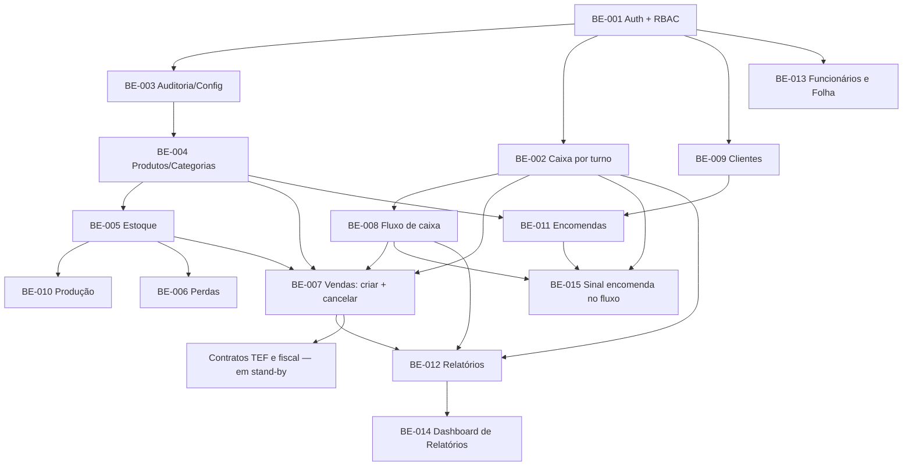

# Specs do Backend e Frontend — S-M-Panificadora-V2

- **Fonte:** `docs/prd/PRD-001-backend-S-M-Panificadora-V2.md` (backend) e `docs/prd/PRD-0XX-*.md` (frontend, um por módulo)
- **Arquitetura:** `docs/adr/ADR-001-clean-code-solid.md`, `docs/adr/ADR-004-seguranca-e-testabilidade-do-backend.md`, `docs/adr/ADR-006-testes-e2e-de-navegador-playwright.md` (Playwright em `demo/`; Cypress não)
- **Convenção de nome:** `SPEC-BE-XXX-slug.md` (backend) e `SPEC-FE-XXX-slug.md` (frontend). Números de BE e FE **não precisam bater** — cada trilha numera na ordem em que foi implementada.
- **Regra de execução:** implementar **na ordem numérica dentro de cada trilha** (BE ou FE). Uma spec só começa quando a anterior está no Definition of Done.

> **Nota de manutenção (2026-08-22):** este README descrevia originalmente uma numeração linear única (`SPEC-001` … `SPEC-019`) prevista antes da implementação começar. Na prática, vários desses cortes foram consolidados em um único arquivo por módulo (ex.: "criar venda" e "cancelar venda" viraram um só `SPEC-BE-007-pdv-vendas.md`), e o projeto passou a nomear por trilha (`SPEC-BE-XXX`/`SPEC-FE-XXX`) em vez de numeração global. A tabela abaixo reflete o que existe de fato no repositório.

Cada spec é uma **entrega vertical testável**: ao terminá-la, o sistema faz algo novo que dá para provar com testes automatizados (e, quando houver HTTP, com chamada real). Não se entrega "metade de regra de negócio" sem critério de aceite.

---

## 1. Como usar

1. Abrir a spec da vez (`SPEC-BE-XXX-...md` ou `SPEC-FE-XXX-...md`).
2. Implementar só o que está no escopo. O que está em "fora de escopo" pertence a uma spec posterior.
3. Cobrir o **plano de testes** implícito nos critérios de aceite da própria spec (unidade sem banco + integração do fluxo crítico).
4. Só então avançar para a próxima.

---

## 2. Backend — o que já existe

| Spec | Módulo | Cobre (do plano original) |
|---|---|---|
| [SPEC-BE-001](./SPEC-BE-001-autenticacao-e-usuarios.md) | Autenticação + Usuários/RBAC | Login, JWT, seed admin, CRUD de usuários e permissões |
| [SPEC-BE-002](./SPEC-BE-002-caixa-por-turno.md) | Caixa por Turno | Abrir/fechar/prévia, um turno aberto por período |
| [SPEC-BE-003](./SPEC-BE-003-auditoria-e-configuracoes.md) | Auditoria + Configurações | Infra de auditoria best-effort; parâmetros da loja |
| [SPEC-BE-004](./SPEC-BE-004-produtos-e-categorias.md) | Produtos e Categorias | Catálogo, unicidade de nome por categoria, soft delete |
| [SPEC-BE-005](./SPEC-BE-005-estoque.md) | Estoque | Fórmula de disponível, rollover, `DebitarEstoque`/`ReverterDebito` |
| [SPEC-BE-006](./SPEC-BE-006-perdas.md) | Perdas | Registro debita estoque; custo automático; whitelist de motivo |
| [SPEC-BE-007](./SPEC-BE-007-pdv-vendas.md) | PDV — Vendas | Criar venda (transação única) **e** cancelar venda (estorno/correção pendente) |
| [SPEC-BE-008](./SPEC-BE-008-fluxo-de-caixa.md) | Fluxo de Caixa | Lançamento manual no turno; filtro por turno |
| [SPEC-BE-009](./SPEC-BE-009-clientes.md) | Clientes | CRUD mínimo; soft delete com reativação |
| [SPEC-BE-010](./SPEC-BE-010-producao.md) | Produção | Lançamento incrementa `produzido` com rastro de quem/quando |
| [SPEC-BE-011](./SPEC-BE-011-encomendas.md) | Encomendas | Numeração própria; total recalculado; vínculo opcional com Cliente; nunca debita estoque (ADR-002, Decisão 3) |
| [SPEC-BE-012](./SPEC-BE-012-relatorios.md) | Relatórios | 4 relatórios só-leitura: vendas, fechamento de caixa, curva ABC, resultado — sem tabela própria |
| [SPEC-BE-013](./SPEC-BE-013-funcionarios-e-folha.md) | Funcionários e Folha | Cadastro, adiantamento, ocorrências (falta/atestado/hora extra), fechamento simplificado — admin-only, sem PRD legado disponível (ver Seção 0 da spec) |
| [SPEC-BE-014](./SPEC-BE-014-dashboard-relatorios.md) | Dashboard de Relatórios | Extensão do relatório de Vendas (ticket médio, itens, nº de vendas) + relatório novo de vendas por hora, sem faixa fixa (correção do V1) |
| [SPEC-BE-015](./SPEC-BE-015-sinal-encomenda-no-fluxo.md) | Encomendas + Fluxo | Sinal > 0 lança no caixa na criação; reabrir/cancelar estorna todos os lançamentos do pedido (PRD-018) |

**Em stand-by (aguardando priorização):** Contratos TEF e Fiscal.

Fundação HTTP (CORS, CSP, rate limit geral, abort sem `JWT_SECRET`) e persistência/migrations não têm spec própria — foram implementadas como parte da infraestrutura consumida desde a SPEC-BE-001 (ver `backend/src/server.js`, `bootstrap.js`, `app.js`).

---

## 3. Frontend — o que já existe

| Spec | Módulo |
|---|---|
| [SPEC-FE-001](./SPEC-FE-001-fundacao-e-arquitetura-do-frontend.md) | Fundação (shell, router, cliente HTTP, sessão) |
| [SPEC-FE-002](./SPEC-FE-002-autenticacao-e-sessao.md) | Autenticação e Sessão |
| [SPEC-FE-003](./SPEC-FE-003-caixa-por-turno.md) | Caixa por Turno |
| [SPEC-FE-004](./SPEC-FE-004-produtos-e-categorias.md) | Produtos e Categorias |
| [SPEC-FE-005](./SPEC-FE-005-estoque.md) | Estoque |
| [SPEC-FE-006](./SPEC-FE-006-perdas.md) | Perdas |
| [SPEC-FE-007](./SPEC-FE-007-pdv-vendas.md) | PDV — Vendas (inclui estorno do turno aberto, alternativa C) |
| [SPEC-FE-008](./SPEC-FE-008-fluxo-de-caixa.md) | Fluxo de Caixa |
| [SPEC-FE-009](./SPEC-FE-009-clientes.md) | Clientes |
| [SPEC-FE-010](./SPEC-FE-010-producao.md) | Produção |
| [SPEC-FE-011](./SPEC-FE-011-encomendas.md) | Encomendas (inclui comprovante térmico em 2 vias) |
| [SPEC-FE-012](./SPEC-FE-012-relatorios.md) | Relatórios |
| [SPEC-FE-013](./SPEC-FE-013-funcionarios-e-folha.md) | Funcionários e Folha |
| [SPEC-FE-014](./SPEC-FE-014-usuarios-e-permissoes.md) | Usuários e Permissões — tela admin (backend já existia via SPEC-BE-001) |
| [SPEC-FE-015](./SPEC-FE-015-design-system.md) | Design System — tokens, componentes e navegação, transversal a todos os módulos (ver `PRD-016-redesign-de-interface.md`) |
| [SPEC-FE-016](./SPEC-FE-016-dashboard-relatorios-e-fluxo.md) | Dashboard de Relatórios e Fluxo — cards de KPI e gráficos CSS-only sobre dado já existente (ver `PRD-017-dashboard-de-vendas-e-fluxo.md`) |
| [SPEC-FE-017](./SPEC-FE-017-comprovante-fechamento-termico.md) | Comprovante de fechamento em cupom térmico 80 mm — layout do papel; fluxo `sem_impressao` inalterado (ver PRD-004) |
| [SPEC-FE-018](./SPEC-FE-018-categorias-flutuante.md) | Categorias em caixa flutuante na tela de Produtos (botão ao lado de Novo produto) |
| [SPEC-FE-019](./SPEC-FE-019-sinal-paga-depois-e-troco.md) | Sinal sugerido (metade), “paga depois”, forma/troco na encomenda (PRD-018; depende SPEC-BE-015 no Passo 4) |
| [SPEC-FE-020](./SPEC-FE-020-specs-no-navegador.md) | SPECs no navegador — Chromium da demo **confere** login, caixa e venda (`cd demo && npm run testar`) |

**Ainda não especificado:** Configurações (tela admin), Ponto por celular.

---

## 4. Por que a ordem não segue o roadmap literal do PRD

O roadmap da Seção 9 do `PRD-001-backend` agrupa por tema de produto. A implementação reordenou **por dependência testável**:

| Ajuste | Motivo |
|---|---|
| Caixa antes do PDV | Venda exige turno aberto validado no backend. Sem caixa, criar venda não é testável de ponta a ponta. |
| Perdas antes do PDV | Perda é o débito de estoque mais simples — serviu de ensaio da transação + auditoria + exceção de domínio antes da venda (que ainda mistura caixa). |
| Clientes antes de Encomendas | Encomenda tem vínculo opcional com cliente. Sem cadastro, o vínculo não é testável. |
| Criar e cancelar venda no mesmo arquivo | Na prática os dois fluxos compartilham o mesmo módulo (`sales`) e a mesma transação de domínio o suficiente para não justificar dois documentos separados. |

O conteúdo funcional do PRD não muda. Muda só o **corte de entrega e o agrupamento em arquivos**.

---

## 5. Grafo de dependências (backend)

---

## 6. Decisões de produto fixadas fora do PRD

| Tema | Default adotado | Onde está registrado |
|---|---|---|
| Campo `mínimo` de estoque | **Informativo** (não bloqueia venda). Alerta fica a cargo do frontend. | `ADR-002-defaults-de-dominio-para-especificacao-do-backend.md`, Decisão 1; aplicado em SPEC-BE-005 |
| Cancelar venda de turno já fechado | **Rejeitado** diretamente; vira `CorrecaoPendente`, resolvida no turno atual. | `ADR-002`, Decisão 2; aplicado em SPEC-BE-007 |
| Encomenda debita/reserva estoque? | **Não** nesta fase (igual ao V1). | `ADR-002`, Decisão 3; aplicado em SPEC-BE-011 |

---

## 7. Definition of Done transversal

Vale para **toda** spec que entregue regra de negócio ou rota:

1. Regra na camada de domínio/caso de uso — sem SQL no controller.
2. Teste automatizado da regra crítica, sem banco quando for cálculo de domínio.
3. Operação que altera dinheiro ou estoque gera auditoria.
4. Erro de regra de negócio → HTTP e mensagem claros, nunca stack trace nem 500 para condição esperada.
5. Rota protegida pela permissão correta (RBAC) e documentada na própria spec.
6. Débito técnico da Seção 6 do PRD, se listado na spec, resolvido de fato.

---

## 8. Estrutura real de cada spec de backend

Todas as specs de backend já escritas seguem este esqueleto (ver SPEC-BE-005/006/009 como referência):

1. Metadados (módulo, depende de, PRD de origem, consumido por)
2. Objetivo técnico
3. Modelo de dados
4. Camada de domínio (entidade, invariantes, exceções)
5. Camada de aplicação (casos de uso)
6. Contratos de API
7. Diferenças em relação ao V1 (rastreabilidade) — ou nota "módulo novo" quando não há equivalente legado
8. Critérios de aceite técnicos
